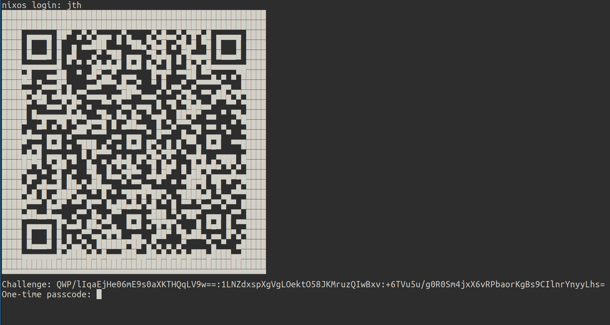

# smartconsole

## what

Passwordless, pubkey encryption, challenge-based PAM-login module.

The module uses the user's public key to encrypt a one-time password which can be decrypted by the user's private key and entered into the interactive console to login - no permanent/persistent user password required.

This project contains the PAM-module itself as well as a utility CLI for generating keypairs and decrypting challenges.

tldr, login screenshot:



The challenge is outputted in plain text as a base64 string. This string can be copy/pasted into the decryption utility to get the onetime login password. With many graphical consoles however, it's not possible to copy-paste text directly to/from the remote machine - hence the challenge string is also encoded into an unicode-represented 2D barcode, which can be copied as a screenshot directly to the decryption tool.

## why

You want to have a passwordless declarative Linux system. Why? Passwords are annoying, because they are secrets - and thus cannot live unencrypted in your Git repo. Even though you replace plaintext passwords with shadow hashes, you still don't want password hashes hanging out on Github.

So what can you do to avoid passwords?

1. Make passwords an imperative thing, forcing users to run `passwd` on any new system in order to set a password.

2. Just don't have them at? Use SSH pubkey auth only and passwordless sudo.


Solution 1 will ensure that shadow hashes only live locally on the target system, but will introduce an imperative step to host provisioning. Also, this is hard to make scalable when managing many hosts.

Solution 2 _seems_ nice, until you don't have network or your SSH daemon is not running for some reason. Usually you'd fallback to password login on a physical or virtual console.

## how (the pam-module)

Example:

`/etc/pam.d/login`:

```
...

auth sufficient libsmartconsole.so key_dir=/var/secrets/smartconsole attempts=3

...
```

Above example configures smartconsole only, consider falling back to plain unix password if desired. Also: You'll still need pam_unix for account management and something else (like systemd) for session management.

**Avaiable pam-args:**

`key_dir`: (if not set, default: /var/secrets/smartconsole). Where to look for keys. In order for a user to be able to login, a file must exist in the key_dir: `<username>.public`. Similarly, the key_dir must contain `server.private` (hardcoded name for now) in order for the encryption box to work.  If the user pubkey doesn't exist, the pam module exits with "USER_UNKNOWN". If the server private key doesn't exist: "AUTH_ERR".

`attempts`: (if not set, default: 3). Number of attempts to enter the onetime password before the pam module exits with: "MAXTRIES".

If pam_unix is next authentication method and also marked as "sufficient", the user will be prompted for standard unix password after libsmartconsole has exitted.

## how (the cli)

You can use the CLI for generating keypairs or for decrypting challenges.

```
USAGE:
    smccli [OPTIONS] <SUBCOMMAND>

OPTIONS:
    -h, --help                 Print help information
        --key-dir <key-dir>    Path at which to read and write keys (overrides env var:
                               $SMARTCONSOLE_KEY_DIR) (default: $HOME/.smartconsole)
    -V, --version              Print version information

SUBCOMMANDS:
    decrypt    
    help       Print this message or the help of the given subcommand(s)
    keygen     
```


### keygen

```
> smccli keygen --help

USAGE:
    smccli keygen [OPTIONS]

OPTIONS:
    -h, --help           Print help information
        --name <name>    Name of the generated keypair (default: <current-timestamp>)
        --path <path>    Path in which to place the generated keypair, defaults to "--key-dir"
```

By default, generated keys will end up in the key-dir. If you don't use any of the three ways to override it, the key dir will be $HOME/.smartconsole.

Give your key a name with `--name <name>`. Output files will be named `<name>.private` and `<name>.public` respectively.

### decryption

```
USAGE:
    smccli decrypt [OPTIONS]

OPTIONS:
    -c, --clipboard                    decrypt from barcode image in the clipboard (default)
    -f, --file <file>                  decrypt from barcode image at file path
    -h, --help                         Print help information
    -k, --private-key <private-key>    optionally, use this identity private key to decrypt the
                                       challenge (if not set, key_dir will be scanned for private
                                       keys)
    -p, --public-key <public-key>      optionally, use this server public key to verify the
                                       decrypted challenge
```

The default decryption-action is to look for a barcode image in the clipboard and try to decrypt the content of that. By default, the server public key is disclosed in the barcode itself, so the only thing needed to decrypt is the user private key. smccli will scan the key-dir for files that ends with `.private` and try decrypting the challenge sequentially with all found keys until one of them works. By using the cli options `--private-key` or `--public-key` it's possible to pin the keys used for decryption. `--private-key` in particular disables the "scanning" for usable keys and makes decryption fail fast if the provided private key doesn't work.

### logging

The CLI logs information to stdout. Use the environment variable `RUST_LOG` to set log levels:

- error
- warn
- info
- debug
- trace

Default loglevel is `info`.

## Building

You can build the workspace directly with cargo: `cargo build` - `cargo build --lib` or `cargo build --bin smccli` respectively to build either the pam lib or the CLI.

### Nix

Enter the develop shell to get Rust tools like cargo, rustfmt etc.

The CLI and the pamlib can be build as flake packages: `nix build .#smartconsole-cli` or `nix build .#smartconsole-libpam`.

A note on PAM configuration on NixOS systems:

The PAM-NixOS-module is difficult to customize/extend and I ended up overwriting the pam login-service entirely:

```nix
  security.pam.services.login.text = ''
    # Account management.
    account required pam_unix.so

    # Authentication management.
    auth sufficient ${pkgs.smartconsole-libpam}/lib/libsmartconsole.so
    auth sufficient pam_unix.so nullok likeauth try_first_pass
    auth required pam_deny.so

    # Password management.
    password sufficient pam_unix.so nullok sha512

    # Session management.
    session required pam_env.so conffile=/etc/pam/environment readenv=0
    session required pam_unix.so
    session required pam_loginuid.so
    session required ${pkgs.linux-pam}/lib/security/pam_lastlog.so silent
    session optional ${pkgs.systemd}/lib/security/pam_systemd.so
  '';
```

.. notice the `libsmartconsole.so` line in there. All the other stuff is upstream login pam-stuff. See: https://github.com/NixOS/nixpkgs/blob/master/nixos/modules/security/pam.nix

Oh right, and.. You probably want something like: `console.font = "LatArCyrHeb-16";` or another console font that is capable of displaying unicode boxes used to render the barcode.
